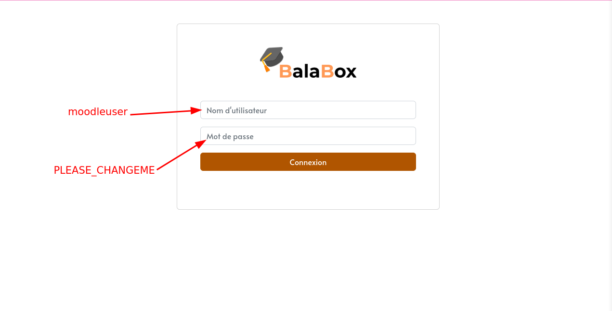
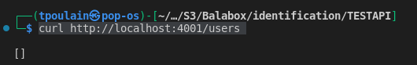
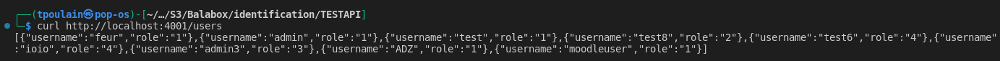
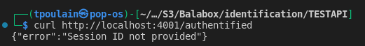
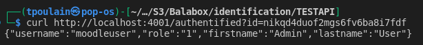
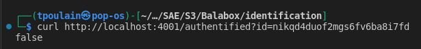
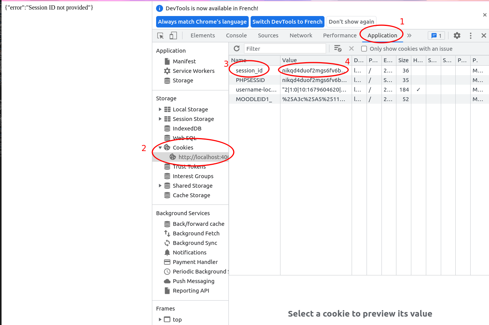
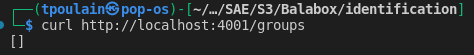
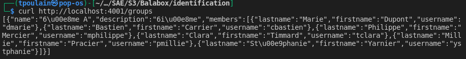

# BalaBox : Service d'identification

Ce dépôt contient le code source du service d'identification intégré à
la [BalaBox], ainsi que la documentation y afférente.

# Le service d'identification

Le service d'identification de la [BalaBox] permet aux élèves de
s'identifier à travers une interface Web avant d'accéder à l'un des
services offert par celle-ci. Cette phase d'identification permet
d'offrir à l'enseignant plusieurs fonctionnalités intéressantes, comme
la création d'un annuaire de classe à partir de la liste des élèves
qui se sont identifiés, la constitution de groupes de travail et la
gestion des absences.

## Fonctionnalités offertes par le service d'identification

Le service d'identification offre les fonctionnalités suivantes:

1. création d'un annuaire de classe par saisie des noms et prénoms des élèves, import d'une liste existante (fichier CSV) et import des comptes Moodle de la MoodleBox
1. modification d'un annuaire de classe
1. suppression d'un annuaire de classe
1. association d'un élève, ou groupe d'élèves, à un terminal mobile à travers une interface "élève" simple
1. création de comptes Moodle à partir de l'annuaire avec génération automatique des mots de passe.

## Mise en œuvre du service d'identification

Le service d'identification est composé de 3 parties: une API REST,
une interface Web élève d'identification et une interface Web
enseignant d'administration permettant de créer un annuaire de classe,
des utilisateurs, gérer leurs droits...

L'API REST, qui expose toutes les fonctionnalités présentées
précédemment, est utilisée par les interfaces Web élève et enseignant,
mais aussi par d'autres services de la [BalaBox] afin de connaître
quels sont les élèves connectés/identifiés.

L'API REST offre un accès sécurisé aux fonctionnalités qu'elle expose
à travers un mécanisme de jetons.

[balabox]: https://balabox.gitlab.io/balabox/
[moodlebox]: https://moodlebox.net

# Intégrer ce travail dans la Raspberry Pi

N'hésitez pas à consulter le [README](https://gitlab.com/balabox/identification/-/blob/main/Installation/README.md) de la partie Installation pour installer le service d'identification et le docker dans votre Raspberry Pi.

# Application interne : Balabox Manager

Pour optimiser notre temps et éviter d'avoir besoin en permanence de la raspberry pi, nous avons créé une application interne qui sera découpée en deux parties : Balabox Machine Manager et Docker Manager. La présentation de ces deux parties est décrite dans ce [lien](https://gitlab.com/balabox/identification/-/tree/main/BalaboxManager).

# Moodle on Alpine Linux

* Built on the lightweight image https://github.com/erseco/alpine-php-webserver
* Very small Docker image size (+/-70MB)
* Uses PHP 8.1 for better performance, lower cpu usage & memory footprint
* Multi-arch support: 386, amd64, arm/v6, arm/v7, arm64, ppc64le, s390x
* Optimized for 100 concurrent users
* Optimized to only use resources when there's traffic (by using PHP-FPM's ondemand PM)
* Use of runit instead of supervisord to reduce memory footprint
* Configured cron to run as non-privileged user https://github.com/gliderlabs/docker-alpine/issues/381#issuecomment-621946699
* docker-compose sample with PostgreSQL
* Configuration via ENV variables
* Easily upgradable to new moodle versions
* The servers Nginx, PHP-FPM run under a non-privileged user (nobody) to make it more secure
* The logs of all the services are redirected to the output of the Docker container (visible with `docker logs -f <container name>`)
* Follows the KISS principle (Keep It Simple, Stupid) to make it easy to understand and adjust the image to your needs

## Usage

Start the Docker containers:

    docker-compose up

Login on the system using the provided credentials (ENV vars)

## Configuration
Define the ENV variables in docker-compose.yml file

| Variable Name               | Default              | Description                                                              |
|-----------------------------|----------------------|--------------------------------------------------------------------------|
| LANG                        | en_US.UTF-8          |                                                                          |
| LANGUAGE                    | en_US:en             |                                                                          |
| SITE_URL                    | http://localhost     | Sets the public site url                                                 |
| SSLPROXY                    | false                | Disable SSL proxy to avod site loop. Ej. Cloudfare                       |
| DB_TYPE                     | pgsql                | mysqli - pgsql - mariadb                                                 |
| DB_HOST                     | postgres             | DB_HOST Ej. db container name                                            |
| DB_PORT                     | 5432                 | Postgres=5432 - MySQL=3306                                               |
| DB_NAME                     | moodle               |                                                                          |
| DB_USER                     | moodle               |                                                                          |
| DB_PREFIX                   | mdl_                 | Database prefix. WARNING: don't use numeric values or moodle won't start |
| MY_CERTIFICATES             | none                 | Trusted LDAP certificate or chain getting through base64 encode          |
| MOODLE_EMAIL                | user@example.com     |                                                                          |
| MOODLE_LANGUAGE             | en                   |                                                                          |
| MOODLE_SITENAME             | New-Site             |                                                                          |
| MOODLE_USERNAME             | moodleuser           |                                                                          |
| MOODLE_PASSWORD             | PLEASE_CHANGEME      |                                                                          |
| SMTP_HOST                   | smtp.gmail.com       |                                                                          |
| SMTP_PORT                   | 587                  |                                                                          |
| SMTP_USER                   | your_email@gmail.com |                                                                          |
| SMTP_PASSWORD               | your_password        |                                                                          |
| SMTP_PROTOCOL               | tls                  |                                                                          |
| MOODLE_MAIL_NOREPLY_ADDRESS | noreply@localhost    |                                                                          |
| MOODLE_MAIL_PREFIX          | [moodle]             |                                                                          |
| client_max_body_size        | 50M                  |                                                                          |
| post_max_size               | 50M                  |                                                                          |
| upload_max_filesize         | 50M                  |                                                                          |
| max_input_vars              | 5000                 |                                                                          |

## Pour se connecter

Le username et le mot de passe varient en fonction des paramètres (voir ci-dessus).

# API REST

## Récupérer la liste des utilisateurs connectés 

> curl http://localhost:4001/users

Exemple 1 :

Il n'y a pas d'utilisateurs connectés

Exemple 2 :

Il y a des utilisateurs connectés

## Vérifier si un utilisateur est connecté

> curl http://localhost:4001/authentified?id= *session_id*

exemple 1 :

Mauvaise utilisation de l'API

Exemple 2 :

L'utilisateur à cette session_id est connecté, on récupère ses informations

Exemple 3 : 

L'utilisateur n'est pas connecté

## Récupérer le session_id ?

Il est récupérable également en javascript grâce à ce code javascript :

## Récupérer les groupes

Exemple 1 :

Il n'y a pas de groupes

Exemple 2 :

On obtient un tableau de groupes